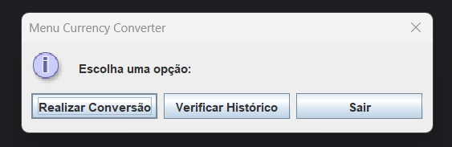
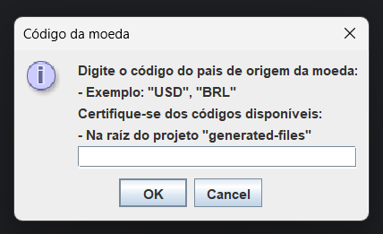
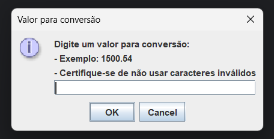
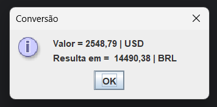
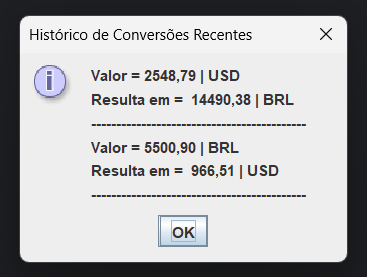
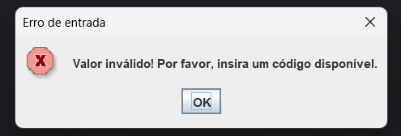

# 💱 Currency Converter (Java + Swing + ExchangeRate API)

Este projeto foi desenvolvido como parte do desafio da fase de especialização Back-End do programa **Oracle ONE - Alura**. O objetivo é construir um conversor de moedas com suporte a pelo menos 6 moedas, utilizando a **ExchangeRate API**, **Java SE**, a biblioteca **Gson** para manipular JSON e uma interface simples com **Swing (JOptionPane)**.

---

## 📌 Funcionalidades

- Busca de taxa de conversão atual entre duas moedas via ExchangeRate API.
- Interface gráfica com menus simples utilizando `JOptionPane`.
- Possibilidade de ver as últimas conversões feitas ainda em memória.
- Armazenamento de histórico de conversões em um arquivo `.txt`.
- Geração e leitura local dos códigos de moedas suportados em ordem alfabética (evita requisições desnecessárias).
- Implementação de leitor de variáveis de ambiente.
- Manipulação de dados JSON com Gson.
- Organização modular com DTOs, serviços e utilitários.

---

## 🧠 Tecnologias utilizadas

- Java 21 (Java SE)
- [ExchangeRate API](https://www.exchangerate-api.com/)
- Swing (JOptionPane)
- Gson (para serialização e desserialização de JSON)

---

## 🧩 Componentes principais

### 🔗 `ExchangeRateClient.java`

Esta classe é responsável por realizar requisições HTTP à API ExchangeRate. Ela utiliza o **`HttpClient`** para enviar requisições HTTP, **`HttpRequest`** para configurar as URLs das requisições e **`HttpResponse`** para capturar as respostas da API. As funções dessa classe são usadas para buscar os códigos das moedas suportadas e as taxas de conversão entre moedas.

### 🔍 `DataExtractor.java`

A classe **`DataExtractor`** é responsável por processar os dados obtidos das requisições. Ela utiliza a biblioteca **Gson** para deserializar o JSON retornado pela API em objetos Java. Além disso, ela oferece métodos para obter os códigos de moedas de um arquivo local ou diretamente da API, evitando assim requisições desnecessárias. Também é responsável por buscar e retornar a taxa de conversão entre duas moedas.

### 🗃️ `FileGenerator.java`

A classe **`FileGenerator`** é encarregada de gerar e gerenciar os arquivos locais essenciais para o funcionamento da aplicação. Ela cria o arquivo **`currencies-code.txt`**, que armazena os códigos das moedas, e o **`conversion-logs.txt`**, que armazena o histórico de conversões realizadas. Esses arquivos são utilizados para reduzir a necessidade de chamadas à API e para manter um histórico persistente das conversões.

### 🔐 `EnvLoader.java`

A classe **`EnvLoader`** é responsável por carregar variáveis de ambiente de um arquivo `.env` para o sistema. Ela lê o arquivo linha por linha, ignora comentários e linhas vazias, e define as variáveis no sistema utilizando **`System.setProperty()`**. Isso permite que as configurações, como chaves de API e credenciais, sejam facilmente carregadas e utilizadas pela aplicação sem precisar hardcodificar esses valores no código fonte.

### 🧾 `Input.java` e `MenuOptions.java`

- **`Input.java`**: Essa classe gerencia as entradas do usuário. Utilizando **`JOptionPane`**, ela coleta os códigos de moedas e os valores de conversão. Também valida as entradas para garantir que o usuário forneça dados válidos.

- **`MenuOptions.java`**: Esta classe exibe um menu interativo com duas opções além da saída do programa:
  
---

1. Realizar conversão de moedas.

  
  
  
---

2. Verificar histórico de conversões.

   
---

Ela organiza as etapas da conversão e chama as funções de entrada, conversão e exibição de histórico. Caso o usuário forneça dados inválidos, o menu volta a ser exibido para uma nova tentativa.


---

## 🗂️ Diretório `generated-files`

Este diretório é criado automaticamente pela aplicação e tem como objetivo armazenar dados importantes em disco, evitando requisições desnecessárias à API e mantendo um histórico das conversões realizadas. Ele contém dois arquivos principais:

---

### 📄 `currencies-code.txt`

Contém a lista de moedas suportadas pela aplicação, extraídas da **ExchangeRate API**. Os dados são formatados em colunas para facilitar a leitura. O programa utiliza este arquivo local para validar os códigos de moeda inseridos pelo usuário, evitando chamadas constantes à API.

**Exemplo de conteúdo:**

````
Código     Moeda
------------------------------------------
FJD        Fiji Dollar                             
MXN        Mexican Peso                            
SCR        Seychellois Rupee                       
TVD        Tuvaluan Dollar                         
CDF        Congolese Franc                         
BBD        Barbados Dollar                         
GTQ        Guatemalan Quetzal                      
...
````
---

### 📄 `conversion-logs.txt`

Armazena o histórico das conversões realizadas durante a execução da aplicação. Cada log inclui a data e hora da conversão, o valor inserido, os códigos das moedas envolvidas e o resultado.

**Exemplo de conteúdo:**

````
Log de Conversão - 25-04-2025 18:05:33
Valor = 2000,00 | BRL
Resulta em =  351,40 | USD
------------------------------------------
Log de Conversão - 25-04-2025 18:06:23
Valor = 759451,00 | USD
Resulta em =  4317630,83 | BRL
------------------------------------------
Log de Conversão - 25-04-2025 18:06:38
Valor = 1548,00 | BRL
Resulta em =  1548,00 | BRL
------------------------------------------
````
Esses arquivos são manipulados pelas classes `FileGenerator` e `DataExtractor`, e são atualizados automaticamente conforme o uso da aplicação.


---

## Badge de Entrega do Desafio


---

